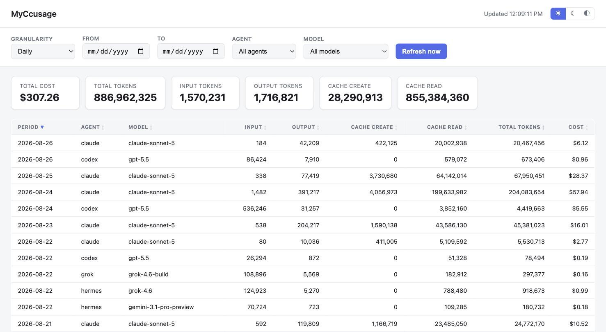

# homebrew-myccusage

Homebrew tap for **MyCcusage** — a local web dashboard for [`ccusage`](https://www.npmjs.com/package/ccusage) usage data. Shows daily/weekly/monthly AI agent usage (cost, tokens, cache) with filtering and sorting, auto-refreshing every minute.



## Install

```bash
brew tap shokk/myccusage
brew trust shokk/myccusage
brew install myccusage
```

`brew trust` is a one-time step Homebrew requires for any third-party tap the first time you use it (not specific to this formula) — without it, `brew install` will fail with "Refusing to load formula ... from untrusted tap."

## Requirements

MyCcusage reads data through the [`ccusage`](https://formulae.brew.sh/formula/ccusage) CLI. It's a Homebrew dependency of this formula, so `brew install myccusage` installs it automatically — no separate step needed.

## Usage

```bash
myccusage
```

Starts a local server at `http://127.0.0.1:4317` (localhost only — nothing is exposed to your network) and prints the URL. Open it in a browser.

```
Usage: myccusage [options]

Options:
  -p, --port <number>   Port to listen on (default: 4317, or $PORT)
      --host <address>  Address to bind to (default: 127.0.0.1)
  -v, --version          Print the version and exit
  -h, --help             Print this help and exit
```

### What the dashboard gives you

- **Granularity**: daily, weekly, or monthly, matching `ccusage`'s own grouping
- **Date range filter**: native calendar picker (from/to), passed straight through to `ccusage --since`/`--until`
- **Agent and model filters**: dropdowns populated from whatever agents/models actually appear in your data (Claude, Codex, Gemini, Grok, etc. — whatever `ccusage` detects)
- **Sortable columns**: click any column header to sort by it, click again to reverse. Period defaults to most-recent-first.
- **Summary cards**: total cost and token breakdown (input/output/cache create/cache read) for the current filter
- **Light / dark / system theme**, remembered across visits
- **Auto-refresh**: polls every 60 seconds; a "Refresh now" button forces an immediate reload

Nothing is cached or stored server-side — every request runs `ccusage` fresh, and nothing leaves your machine.

## How it works

The formula installs `server.js` and `public/` (a small dependency-free Node app — no `npm install` step, no bundler) into `libexec`, and writes a `myccusage` wrapper script into `bin` that runs it with Homebrew's own `node`. The server shells out to `ccusage <daily|weekly|monthly> --json --by-agent [--since --until]` on each request and serves the result as JSON; the frontend is static HTML/CSS/JS that polls that endpoint.

## Uninstall

```bash
brew uninstall myccusage
brew untap shokk/myccusage
```

## License

MIT
